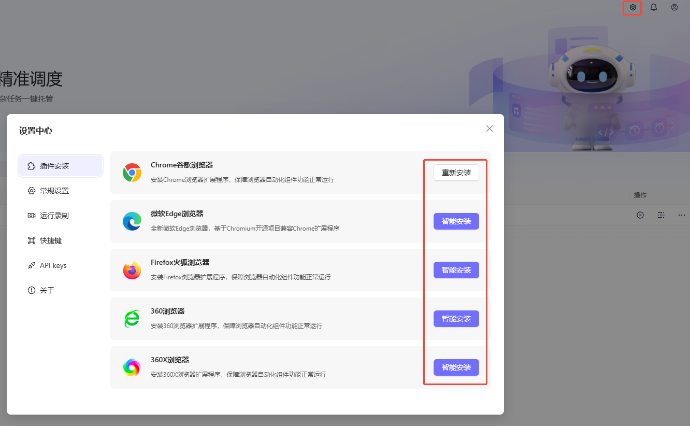

# 🤖 Astron RPA 常见问题解答 (FAQ)

> 💡 **提示：** 带有 🆕 标记的为本次新增内容，带有 🔄 标记的为本次更新内容。

## 📚 文档目录

- [🔧 安装与部署](#-安装与部署)
- [👥 客户端相关](#-客户端相关)
- [⚡ 性能与加载](#-性能与加载)
- [📖 功能使用](#-功能使用)
- [🐛 故障排查](#-故障排查)
- [📞 获取帮助](#-获取帮助)

---

## 🔧 安装与部署

### Q: 开源版本客户端是否能在 Linux 上运行？

**A:** ❌ **暂时不行！** 开源版本的 Astron RPA 客户端目前仅支持 Windows 系统。

**支持的系统：**
- ✅ Windows 10/11

### Q: 🆕 服务端 atlas 容器启动后自动退出正常吗？

**A:** ✅ **正常！** Atlas 容器用于数据库 Schema 迁移，任务完成后会自动退出。只要日志显示 "Schema is synced" 即表示成功。

### Q: 🆕 Agent 服务端无法连接 RPA 服务？

**A:** 请检查 Agent 部署目录下的 `.env` 文件，确保 `RPA_URL` 设置为 RPA 服务端的实际地址（如 `http://YOUR_IP:32742`）。

### Q: 🆕 客户端安装卡在最后一步很久？

**A:** 

请尝试：
1. 卸载旧版本
2. 手动删除安装目录下的 `data` 文件夹
3. 重新运行安装包

### Q: 安装时提示 Windows Installer 程序包有问题？

**A:**
这通常是因为系统缺少必要的运行时组件。
**解决方案：** 请下载并安装/更新 [Microsoft Edge WebView2 Runtime](https://developer.microsoft.com/en-us/microsoft-edge/webview2/)。

### Q: 🆕 本地构建客户端后启动出现 404 NotFound？

**A:** 
不建议在本地自行构建客户端，可能会遇到配置或环境问题。
建议直接从 [Release 页面](https://github.com/iflytek/astron-rpa/releases) 下载官方提供的稳定版安装包（如 v1.1.2+）。

### Q: 🆕 离线内网环境下可以部署和运行 RPA 吗？如何导入镜像？

**A:** ✅ **可以！**
在离线环境下，需要在有网环境使用 `docker save` 导出镜像包，并在内网使用 `docker load` 导入。导入后请使用 `docker images` 检查镜像 Tag 是否完整，如果出现无名称（dangling）镜像，请使用 `docker tag` 重新打标签。

### Q: 🆕 本地构建客户端 (`build.bat`) 时，安装 `pywinhook`、`psycopg2` 等依赖报错失败？

**A:**
1. **C++ 编译环境**：确保已安装 Microsoft Visual C++ 14.0 或更高版本（包含 MSVC v143 和 Win10/11 SDK）。
2. **权限问题**：请使用管理员权限（Administrator）运行构建脚本。
3. **依赖裁剪**：如果当前场景不需要特定数据库驱动（如 Oracle/PostgreSQL），可以修改 `/engine/components/astronverse-database/pyproject.toml`，移除 `psycopg2` 和 `cx-oracle` 等依赖，以绕过复杂的本地编译。

### Q: 🆕 开源版 RPA 支持前后端分离部署以便于二次开发调试吗？

**A:** ✅ **支持！**
前后端分离模式在开发调试场景下是完全支持且推荐的，可以独立运行和调试前端与后端代码。请确保拉取最新代码进行配置。

---

## 👥 客户端相关

### Q: 是否需要安装客户端？

**A:** ✅ **需要！** RPA 目前没有 Web 版本，需要客户端运行。

### Q: 🆕 开源版与企业版 RPA 有区别吗？

**A:** 开源版 RPA 客户端与平台版通用，但需注意配置对应的服务端地址。

---

### Q: 我是否一定需要手动构建客户端？

**A:** ✅ **不需要！** 您可以直接下载 [Release 版本](https://github.com/iflytek/astron-rpa/releases) 的 msi 安装包直接安装。

---

### Q: 如何快速部署最新的代码？

**A:** 

#### 服务端更新方式 1️⃣：快速更新（下载最新镜像）

适合生产环境，最简单快速的更新方法。

```bash
# 1. 停止旧容器
docker-compose down

# 2. 删除旧镜像（可选，如果想清理本地镜像）
docker rmi ghcr.io/iflytek/astron-rpa/openapi-service:latest
docker rmi ghcr.io/iflytek/astron-rpa/ai-service:latest
docker rmi ghcr.io/iflytek/astron-rpa/robot-service:latest

# 3. 启动新容器并自动下载最新镜像
docker-compose up -d
```

#### 服务端更新方式 2️⃣：本地编译（适合开发者）

允许自定义修改，适合开发测试环境。

```bash
# 1. 拉取最新代码
git pull origin main

# 2. 进入 docker 目录
cd docker

# 3. 编辑 docker-compose.yml
# - 注释掉 image 行
# - 取消注释 build 部分

# 示例配置：
# services:
#   openapi-service:
#     # image: ghcr.io/iflytek/astron-rpa/openapi-service:latest
#     build:
#       context: ..
#       dockerfile: backend/openapi-service/Dockerfile

# 4. 本地编译并启动
docker-compose up -d --build

# 5. 等待编译完成（可能需要几分钟）
docker-compose logs -f
```

> 💡 **更新提示：** 
> - 方式 1️⃣ 最快速，适合生产环境
> - 方式 2️⃣ 允许自定义修改，适合开发者
> - 更新过程中数据库数据会保留（mysql 容器数据在 volumes 中）

#### 服务端更新方式 3️⃣：使用 ATLAS 更新数据库

快速更新数据库模式，启动 ATLAS 容器进行自动迁移。

```bash
# 1. 启动 ATLAS 容器进行数据库迁移
docker-compose up -d atlas

# 2. 查看 ATLAS 迁移日志（确保迁移成功）
docker-compose logs -f atlas
```

> 💡 **ATLAS 说明：**
> - ATLAS 是数据库版本管理工具，用于自动执行数据库迁移脚本
> - 每次服务端更新时，数据库模式可能会有变化，需要通过 ATLAS 进行更新
> - 数据库中的现有数据会被保留，仅更新表结构和模式

---

#### 客户端更新方式 1️⃣：直接更新 Python 包

快速开发调试，仅修改部分包。

如果你修改了 `engine` 目录下的 Python 包（如 `workflowlib`、`executor` 等），可以直接复制到客户端的 Python 环境中：

```bash
# 以修改 workflowlib 为例
# 1. 找到源代码位置
# engine/shared/astronverse-workflowlib

# 2. 复制到客户端安装目录
# 从：\astron-rpa\engine\shared\astronverse-workflowlib\src\astronverse\workflowlib
# 复制到：C:\Program Files\Astron RPA\data\python_core\Lib\site-packages\astronverse\workflowlib
```

**常见包及其位置：**

| 📦 包名 | 📂 源代码位置 | 🎯 目标位置 |
|---------|----------|--------|
| workflowlib | `engine/shared/astronverse-workflowlib/src/astronverse/workflowlib` | `<安装目录>/data/python_core/Lib/site-packages/astronverse/workflowlib` |
| executor | `engine/servers/astronverse-executor/src/astronverse/executor` | `<安装目录>/data/python_core/Lib/site-packages/astronverse/executor` |
| browser | `engine/components/astronverse-browser/src/astronverse/browser` | `<安装目录>/data/python_core/Lib/site-packages/astronverse/browser` |
| 其他包 | `engine/<?>/astronverse-*/src/astronverse/*` | `<安装目录>/data/python_core/Lib/site-packages/astronverse/*` |

> 💡 **重启提示：** 
> - 如果是 Servers 中的包，更新后需要重启客户端以加载新的包

---

#### 客户端更新方式 2️⃣：重新打包安装

多个包更新或需要完整版本时使用。

如果修改的内容较多或者想要完整更新客户端，可以通过 `build.bat` 打包新的客户端 msi 安装包：

```bash
# 1. 在项目根目录运行
.\build.bat

# 2. 等待编译完成（可能需要 10-30 分钟）
# 新的 msi 安装包会生成在 build/dist/ 目录下

# 3. 使用新生成的 msi 安装包覆盖安装
# - 直接运行 build/dist/*.msi 文件
# - 或替换到发布目录供其他用户下载
```

---

#### 更新方式对比表

| 🔄 更新方式 | 🎯 适用场景 | ⚡ 速度 | 📚 复杂度 |
|---------|---------|------|--------|
| 直接复制 Python 包 | 快速开发调试，仅修改部分包 | 🚀 快 | 🟢 简单 |
| 重新打包 msi | 多个包更新，需要完整版本 | 🐢 慢 | 🟡 中等 |
| 下载新 Release | 发布新版本，生产环境更新 | 🔄 中 | 🟢 简单 |

> 💡 **最佳实践：** 
> - 🔨 **开发阶段** → 使用"直接复制"快速迭代
> - ✅ **功能完成** → 使用"build.bat"打包成完整安装包
> - 🚀 **生产环境** → 使用官方 Release 版本

---

## ⚡ 性能与加载

### Q: 为什么软件打开卡在加载？

**A:** 

**以下是几种实践中遇到过的情况：**

#### 1️⃣ 未修改 conf.yaml 中的 **remote_addr**

**❌ 问题现象：** 客户端卡在加载页面

**✅ 解决方案：** 安装好后在安装目录下的 `resources/conf.yaml` 中修改服务端地址：

```yaml
# 32742 为默认端口，如有修改自行变更
remote_addr: http://YOUR_SERVER_ADDRESS:32742/
skip_engine_start: false
```

---

#### 2️⃣ 服务端还没启动完全

**❌ 问题现象：** 新启动的服务还在初始化中

**✅ 解决方案：** 等待一段时间后重启客户端

---

#### 3️⃣ 未修改 .env 中的 CASDOOR_EXTERNAL_ENDPOINT

**❌ 问题现象：** 认证服务无法访问

**✅ 解决方案：**

```bash
# 修改 .env 中 casdoor 的服务配置（8000 为默认端口）
CASDOOR_EXTERNAL_ENDPOINT="http://{YOUR_SERVER_IP}:8000"
```

---

## 📖 功能使用

### Q: 🔄 为什么拾取不到网页元素？为什么运行网页原子能力总是失败？

**A:** 

🔴 **很可能是你没有安装浏览器插件**



**其他常见原因：**
1. **显示设置：** 确保电脑显示器缩放比例为 **100%**。
2. **模式选择：** 抓取网页内容请使用"浏览器插件"模式；抓取浏览器本身（如地址栏）请使用"桌面元素"模式。

其他网页自动化说明可详见 [官方使用指南](https://www.iflyrpa.com/docs/quick-start/web-automation.html)

### Q: 🆕 如何处理网页截图与验证码？

**A:**

1. 使用“网页截图”原子能力。
2. 对于 Canvas 上的文本或特殊验证码，可结合 OCR 或大模型图像识别能力处理。

### Q: 🆕 机器人如何操作具有懒加载（Virtual List）特性的网页下拉菜单？

**A:**

对于渲染选项超过一定数量（如 200 个），但实际 HTML 仅渲染视口内少数几个（如 10 个）的“懒加载”下拉菜单，常规拾取在滚动时会失效。
**解决方案：**
1. **键盘模拟：** 使用“模拟按键”（如向下箭头 `Down`）逐个选中选项。
2. **XPath 自定义：** 如果元素在 DOM 中虽然不可见但存在，尝试自定义 XPath 获取。
3. **图像识别：** 结合图像识别点击进行辅助定位。
4. **滚动页面操作：** 增加滚动操作触发元素渲染，然后再执行抓取或点击。

---

### Q: 如何在流程中使用 AI 能力？

**A:** 

在使用 AI 原子能力之前，需要在部署服务端的时候配置对应的 AI 相关参数。

```yaml
# 大模型 URL 以及对应的 API_KEY（OpenAI 范式均可）
AICHAT_BASE_URL="https://api.deepseek.com/v1/"
AICHAT_API_KEY="sk-xxxxxxxxxxxxxxxxxxxxxxx"

# 讯飞云 OCR 鉴权方式（需要去官网获取）
XFYUN_APP_ID=dxxxxx38
XFYUN_API_SECRET=ZTFxxxxxxxxxxxxxxxxNDVm
XFYUN_API_KEY=c4xxxxxxxxxxxxxxxx8a7

# 云码验证码鉴权方式
JFBYM_ENDPOINT="http://api.jfbym.com/api/YmServer/customApi"
JFBYM_API_TOKEN="xxxxxxxxxxxxxxxxxxxxxxxxxxxxxx"
```

> ⚠️ **重要：** 配置完后重启服务端，确保配置生效

---

### Q: 如何进行外部调用？如何使用 MCP？

**A:** 

关于外部调用，在官方版的 [使用文档](https://www.iflyrpa.com/docs/open-api/overview.html) 中有详细介绍和接口文档。

唯一需要注意的是，所有 URL 需要从官方版的域名改为自己部署服务器的域名。

```bash
# 官方版：
https://newapi.iflyrpa.com/api/rpa-openapi/workflows/get

# 开源版：
http://{IP_ADDRESS}:32742/api/rpa-openapi/workflows/get
```

> 📌 **提醒：** 所有想要被外部调用的机器人需要在设计器中发版，然后在执行器中进行外部调用配置

### Q: 🆕 RPA 流程如何传递参数 (入参/出参)？

**A:** 

- **入参：** 在 RPA 流程设计中定义“流程参数”，外部调用时传入对应 Key-Value。
- **出参：** 通过 HTTP 请求节点或 Python 脚本返回 JSON 数据，后续节点可通过变量引用。

### Q: 🆕 主流程如何向组件传递参数？

**A:** 

1. 在组件中设置“输入参数”（或组件属性）。
2. 发布该组件。
3. 在主流程中重新拖入该组件，即可在右侧配置面板中为这些参数赋值。
> ⚠️ **注意：** 如果组件修改了参数，必须先发版，并在主流程中重新拖入才能生效使用新参数。

### Q: 🆕 组件元素名称在组件内是唯一的吗？组件之间有重复名称影响吗？

**A:** 元素名称在单个组件内是唯一的。不同组件之间的元素名称可以重复，互不影响。

### Q: 🆕 RPA 的网页元素定位（XPath）支持使用变量吗？

**A:** ✅ **支持！** 可以在 XPath 的路径字符串中使用变量或参数，以实现动态元素定位。

### Q: 🆕 网页元素拾取默认使用什么定位方式？如果页面结构变化导致绝对路径改变怎么办？

**A:** 

- 拾取元素时，如果元素有 ID，默认会锁定 ID（作为 XPath 的一部分）。
- 如果网页结构变动导致绝对路径变化，但 ID 没变，可以通过调整 ID 的勾选状态来适应。
- 如果 ID 变动或不稳定，可以考虑取消勾选 ID 属性，改用其他稳定的相对路径或属性进行定位，或者观察页面变动规律手动修改 XPath。

### Q: 依赖包下载失败怎么办？

**A:** 

国内网络环境可能导致连接 PyPI 官方源超时。

**✅ 解决方案：** 配置国内镜像源（如阿里云）。

```ini
# pip 配置示例
[global]
index-url = https://mirrors.aliyun.com/pypi/simple/
trusted-host = mirrors.aliyun.com
```

### Q: 🆕 内网环境（离线）如何安装第三方 Python 库（如 `ddddocr`）？

**A:** 
在无法连接外网的环境下，常规 `pip install` 或离线包可能因为环境差异失败。
**✅ 解决方案（底层注入）：**
1. 在外网准备好所需库的完整依赖文件。
2. 将依赖库文件直接复制集成到 RPA 客户端引擎的 `python_core` 基础环境中（例如 `<安装目录>/data/python_core/Lib/site-packages/`）。
3. 重置客户端的 `venv` 环境以触发环境重建并加载新库。

### Q: 🆕 可以在内网使用吗？

**A:** ✅ **可以！** 只要 RPA 客户端和服务端在同一内网环境下能正常通信即可。

### Q: 🆕 免费版/开源版有流程数量限制吗？

**A:** 开源版通常与个人版保持一致。如果没有特殊的云端账号绑定限制，通常没有严格的数量限制，具体以官方说明或 Release 说明为准。

### Q: 🆕 虚拟桌面运行失败 / 白屏 / 提示 "启用需先授权"？

**A:** 
1. **检查“远程桌面”开关（最常见原因）**: 
   - 即使是 Windows 专业版，默认也可能关闭了远程桌面功能。
   - **操作方法**: 进入 `设置` -> `系统` -> `远程桌面`，确保开关处于 **"开"** 的状态。
2. **系统要求**: 仅支持 Windows 8, Windows Server 2012 及更高版本。
   - ❌ **不支持 Windows Home (家庭版)**：家庭版缺失 RDP 组件。
3. **账户密码**: 
   - 确保当前 Windows 登录账户**设置了密码**。RDP 通常不允许空密码登录。
4. **权限设置**: 
   - 尝试以 **管理员身份** 运行 RPA 客户端。
5. **稳定性**: 该功能目前可能尚不稳定，建议优先在标准桌面环境下运行。

### Q: 🆕 AstronRPA 可以在子流程中添加注释吗？

**A:** 可以。在流程设计器中支持添加注释功能。

### Q: 🆕 星辰 RPA 有控制台吗？开源版开发的流程能被控制台统一调度吗？

**A:** 星辰 RPA 有控制台，但控制台目前**未开源**。开源版本中设计开发的流程目前只能在本地客户端执行，无法由控制台统一调度。

### Q: 🆕 Astron RPA 能操作微信 / 企业微信的界面元素吗？

**A:**
- 旧版微信（如 3.9）可以使用**元素识别**。
- 新版微信、新版企业微信只能使用**图像识别（CV）** 进行操作。

### Q: 🆕 Astron Agent 如何与 Astron RPA 集成？相比 browser-use 类工具有什么优势？

**A:** Astron Agent 可以调用在 Astron RPA 中编排好的 RPA 脚本。相比 browser-use 类的 MCP 工具，RPA 在准确性、执行效率、Token 消耗等方面都有明显优势。

### Q: 🆕 开源版 RPA 中 dify 流程的 URL 写死成官网了，如何改成自己的？LLM 怎么配置？

**A:**
- 开源版部分版本将 dify 流程的 URL 写死为官网地址。如需指向自部署服务，可进入 `openapi-service` 容器中修改对应的 Python 代码，将链接改为自己的地址（请以当前版本实际代码为准）。
- LLM 在服务端 `.env` 中配置（`AICHAT_BASE_URL`、`AICHAT_API_KEY`）。

---

## 🐛 故障排查

### Q: 如何收集问题诊断信息？

**A:** 

当遇到问题时，请查询服务端和引擎端日志：

```bash
# 1️⃣ 查询 Docker 日志
docker ps -a
docker logs [container_name] > logs.txt

# 2️⃣ 查询客户端日志
# 日志保存在：安装目录下\data\logs
# 如果软件安装在 C 盘：%APPDATA%\astron-rpa\logs
```

### Q: 启动报错、白屏或界面异常？

**A:** 

可能是缺少 `Microsoft Edge WebView2 Runtime` 或版本过低（常见于老旧系统或云桌面）。请尝试更新 WebView2 Runtime。

### Q: 🆕 邮件组件使用 imap4 接收邮件时报错（如 search 参数不匹配、unknown encoding utf-8 等）怎么办？

**A:** 这是由于特定邮件服务器交互和编码处理的兼容性问题。建议更新到最新版本的客户端，底层组件已修复编码解析与附件名正则提取空指针问题。在旧版本中遇到时可联系技术支持获取源码补丁。

### Q: 🆕 Excel 自动化执行“复制单元格”等操作时，为什么会异常自动打开新的空白工作簿？

**A:** 可能是底层调度机制导致的实例冲突。在最新的版本中，已优化了 `application.py`，优先接管已存在的 Excel 实例并默认禁用警告弹窗。请确保升级到最新版客户端。

### Q: 🆕 网页元素拾取功能频频失效或导致浏览器闪退？

**A:** 

如果在拾取元素时发生闪退或完全失效，可能是由于系统中运行的其他应用（例如“豆包”客户端）也尝试接管浏览器环境，造成双重冲突。
**解决方案：** 尝试关闭可能的干扰应用，调整配置后重启 RPA 客户端及浏览器。

### Q: 构建或启动提示 "Python复制失败"？

**A:** 

1. **路径问题：** 确保项目路径不包含中文或特殊字符。
2. **权限问题：** 尝试以管理员身份运行。

### Q: Excel/WPS 自动化报错 "未检测到注册表信息"？

**A:**

1. **权限问题：** 尝试以管理员身份运行客户端（或取消管理员身份），有时权限不匹配会导致无法读取注册表。
2. **安装问题：** 确保 Office/WPS 安装完整且未损坏。

### Q: 报错 "send uuid empty" 或端口异常？

**A:**

- **send uuid empty:** 通常是客户端与服务端版本不一致，或连接未建立。请更新到最新版本并重启客户端。
- **端口问题:** 端口 `13160`/`13159` 是 RPA 内部调度服务端口，请确保未被防火墙拦截或占用。

### Q: 客户端程序一直在死循环或报错？

**A:** 检查 `data/logs/picker` 或 `robot-service` 的日志。有时需要清理本地缓存数据（删除 `data` 目录）后重试。

### Q: 🆕 客户端「设置 → 插件安装」页面显示空白？

**A:** 这是已知 BUG。可手动安装浏览器插件，插件目录位于：

```
C:\Users\{用户名}\AppData\Roaming\astron-rpa\python_core\Lib\site-packages\astronverse\browser_plugin\plugins
```

### Q: 服务端 Redis 容器一直重启？

**A:** 
可能是镜像中的启动脚本兼容性问题（如缺少 bash）。
**解决方案：** 
1. 尝试将启动命令中的 `bash` 改为 `sh`。
2. 或者拉取最新的 `latest` 镜像，通常已修复此问题。

---

## 📞 获取帮助

### 🌐 官方渠道

| 渠道 | 链接 | 响应时间 |
|------|------|---------|
| 🐙 GitHub Issues | [提交问题](https://github.com/iflytek/astron-rpa/issues) | 24-48 小时 |
| 💬 Discussions | [讨论区](https://github.com/iflytek/astron-rpa/discussions) | 一周内 |

### 📚 常用资源

- 🏠 [项目主页](https://github.com/iflytek/astron-rpa)
- 📖 [项目介绍](./README.zh.md)
- 📝 [完整安装指南](./BUILD_GUIDE.zh.md)
- 🐳 [Docker 部署指南](./docker/QUICK_START.md)
- 👨‍💻 [使用指南](https://www.iflyrpa.com/docs)

---

## 🔄 更新历史

| 版本 | 日期 | 更新内容 |
|------|------|---------|
| v1.0 | 2025-11-26 | 初始版本发布 |
| v1.1 | TBD | 将添加更多常见问题 |
| v1.1.5 | 2026-01-29 | 架构迁移至 Electron；新增 Computer Use Agent；支持数据表格；Excel V2 组件；开源版与 SaaS 版打平 |

---

> ⏰ **最后更新：** 2026-02-01  
> 👤 **维护者：** DoctorBruce  
> 📜 **许可证：** Apache-2.0

